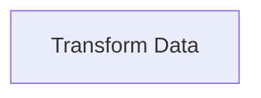

# Neuron Pack: Atomic Compute Transform Pack

This pack is managed and version-controlled. Pack ID: `3f38300b-9367-454d-8a58-ce2a70ebb9c7`.

## Workflows (Neurons)

### Neuron: Compute Transform

- **Type**: `interactive`
- **Topology Profile**: `atomic_io`

**Description**:

#### Topology Diagram

#### Components (Cells)

- **Transform Data** (`compute_transform`)
