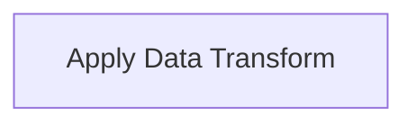

# Neuron Pack: Atomic Compute Transform — canvas state

This pack is managed and version-controlled. Pack ID: `77fc9998-a418-414a-a17f-e0294a6d9d89`.

## Workflows (Neurons)

### Neuron: Atomic Compute Transform

- **Type**: `interactive`
- **Topology Profile**: `atomic_io`

**Description**:

#### Topology Diagram

#### Components (Cells)

- **Apply Data Transform** (`compute_transform`)
