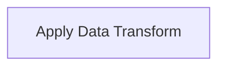

# Neuron Pack: Atomic Transform Neuron — canvas state

This pack is managed and version-controlled. Pack ID: `35be06e1-2faa-4abb-bb11-6613696a5bbc`.

## Workflows (Neurons)

### Neuron: Data Transform

- **Type**: `interactive`
- **Topology Profile**: `atomic_io`

**Description**:

#### Topology Diagram

#### Components (Cells)

- **Apply Data Transform** (`compute_transform`)
