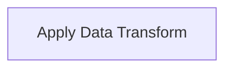
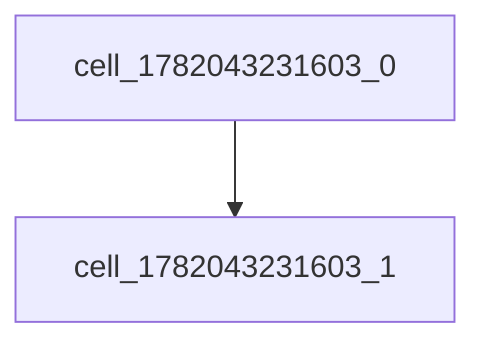
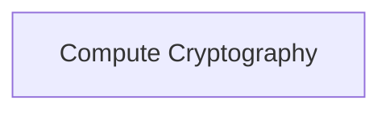

# Neuron Pack: canvas

This pack is managed and version-controlled. Pack ID: `e8fc44f1-c739-49f5-8f71-5e97fc96f8e7`.

## Workflows (Neurons)

### Neuron: durable test

- **Type**: `interactive`
- **Topology Profile**: `None`

**Description**:


### Neuron: cyclic test

- **Type**: `interactive`
- **Topology Profile**: `None`

**Description**:


### Neuron: linear test

- **Type**: `interactive`
- **Topology Profile**: `None`

**Description**:


### Neuron: Atomic Transform

- **Type**: `interactive`
- **Topology Profile**: `atomic_io`

**Description**:


#### Topology Diagram



#### Components (Cells)

- **Apply Data Transform** (`compute_transform`)

### Neuron: atomic test

- **Type**: `interactive`
- **Topology Profile**: `None`

**Description**:


#### Topology Diagram



#### Components (Cells)

- **Unnamed Cell** (`compute_transform`)
  * <details>
      <summary><b>Input Schema</b></summary>

      ```json
      {
        "type": "object"
      }
      ```
    </details>
  * <details>
      <summary><b>Output Schema</b></summary>

      ```json
      {
        "type": "object"
      }
      ```
    </details>
- **Unnamed Cell** (`compute_cryptography`)
  * <details>
      <summary><b>Input Schema</b></summary>

      ```json
      {
        "type": "object"
      }
      ```
    </details>
  * <details>
      <summary><b>Output Schema</b></summary>

      ```json
      {
        "type": "object"
      }
      ```
    </details>

### Neuron: Untitled 1

- **Type**: `interactive`
- **Topology Profile**: `None`

**Description**:


#### Topology Diagram



#### Components (Cells)

- **Compute Cryptography** (`compute_cryptography`)
  * <details>
      <summary><b>Input Schema</b></summary>

      ```json
      {
        "type": "object"
      }
      ```
    </details>
  * <details>
      <summary><b>Output Schema</b></summary>

      ```json
      {
        "type": "object"
      }
      ```
    </details>
