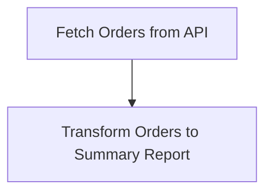

# Neuron Pack: Customer Report

This pack is managed and version-controlled. Pack ID: `e5ff9a84-49fa-4fd8-bfe9-89dd8aba9d40`.

## Workflows (Neurons)

### Neuron: Fetch Orders

- **Type**: `interactive`
- **Topology Profile**: `linear_cognitive`

**Description**:

#### Topology Diagram

#### Components (Cells)

- **Fetch Orders from API** (`io_http`)
- **Transform Orders to Summary Report** (`compute_transform`)
