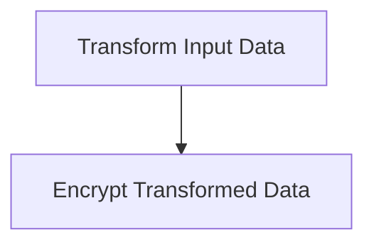

# Neuron Pack: test-1: Simple Data Processing Workflow

This pack is managed and version-controlled. Pack ID: `f206f8b3-c5cf-4373-9c1b-9ead8c36ff30`.

## Workflows (Neurons)

### Neuron: test-1

- **Type**: `interactive`
- **Topology Profile**: `linear_cognitive`

**Description**:
Receives incoming data, processes and transforms it via a Compute Transform cell, then encrypts the output using a Compute Cryptography cell.

#### Topology Diagram

#### Components (Cells)

- **Transform Input Data** (`compute_transform`)
- **Encrypt Transformed Data** (`compute_cryptography`)
