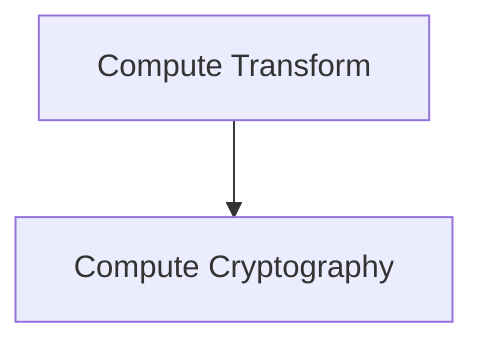

# Neuron Pack: testing 2

This pack is managed and version-controlled. Pack ID: `1ed4b67f-83a3-42b5-8ff6-abb4cfcd9505`.

## Workflows (Neurons)

### Neuron: cyclic test

- **Type**: `interactive`
- **Topology Profile**: `None`

**Description**:

#### Topology Diagram

#### Components (Cells)

- **Compute Transform** (`compute_transform`)
- **Compute Cryptography** (`compute_cryptography`)

### Neuron: durable test

- **Type**: `interactive`
- **Topology Profile**: `None`

**Description**:

#### Topology Diagram

#### Components (Cells)

- **Compute Transform** (`compute_transform`)
- **Compute Cryptography** (`compute_cryptography`)

### Neuron: linear test

- **Type**: `interactive`
- **Topology Profile**: `None`

**Description**:

#### Topology Diagram

#### Components (Cells)

- **Compute Transform** (`compute_transform`)
- **Compute Cryptography** (`compute_cryptography`)

### Neuron: atomic test

- **Type**: `interactive`
- **Topology Profile**: `None`

**Description**:

#### Topology Diagram

#### Components (Cells)

- **Compute Transform** (`compute_transform`)
- **Compute Cryptography** (`compute_cryptography`)
